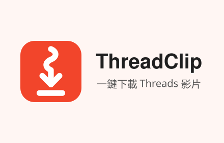

# ThreadClip



一個 Chrome 擴充功能，在 [Threads](https://www.threads.com) 的貼文影片上加入下載按鈕，按一下就能把影片存到電腦。

不用複製網址、不用跳到第三方網站，也不會降低畫質。

## 功能

- **一鍵下載**：每支貼文影片的右上角都有下載按鈕
- **自動命名**：檔名包含帳號與貼文代碼，多影片貼文會自動編號
- **集中存放**：影片統一存到「下載／ThreadClip」資料夾
- **保留來源**：在 MP4 中繼資料寫入原始貼文網址，日後找得到出處；影音內容不重新編碼
- **不收集資料**：沒有追蹤、沒有廣告，所有處理都在瀏覽器內完成

支援 threads.com 與 threads.net，需要 Chrome 116 以上。

## 安裝

Chrome 線上應用程式商店版本正在準備上架，上架後會在這裡附上連結。在那之前，可以用開發人員模式安裝：

1. 下載或 clone 這個 repo
2. 開啟 `chrome://extensions`
3. 打開右上角的「開發人員模式」
4. 點「載入未封裝項目」，選擇這個專案資料夾

## 使用方式

1. 前往 Threads，找到有影片的貼文
2. 點影片右上角的下載按鈕
3. 按鈕顯示「已下載」後，到「下載／ThreadClip」資料夾就能找到影片

### 檔名格式

```
threads_<帳號>_<貼文代碼>.mp4
threads_<帳號>_<貼文代碼>_1.mp4   ← 一則貼文有多支影片時
```

### 寫入的中繼資料

下載的影片會加上以下 MP4 標籤，用來記錄影片來源：

| 標籤 | 內容 |
| --- | --- |
| `comment`、`source` | `https://justmao.com` |
| `original_post` | 原始貼文網址 |

只會改動 MP4 的中繼資料區塊，影音資料完全不動。如果影片格式不如預期、無法寫入標籤，擴充功能仍會存下原始檔案，按鈕則顯示「已下載（未能寫入來源資訊）」。

## 隱私與權限

ThreadClip 不收集、不傳送任何使用者資料，完整說明請看 [隱私權政策](PRIVACY.md)。

| 權限 | 用途 |
| --- | --- |
| `downloads` | 把影片存到電腦 |
| `offscreen` | 在背景處理影片檔、寫入來源資訊 |
| threads.com／threads.net | 在頁面上顯示下載按鈕 |
| cdninstagram.com／fbcdn.net | 從 Threads 的影片 CDN 下載影片檔 |

## 開發

### 架構

```
content.js ──(videoUrl, filename)──▶ background.js ──▶ offscreen.js
偵測影片、插入按鈕                   建立 offscreen、    抓取影片、寫入中繼資料、
                                     呼叫 downloads API  產生 blob URL
```

| 檔案 | 說明 |
| --- | --- |
| `src/content.js` | 偵測頁面上的影片並插入按鈕。影片以 `blob:`（MediaSource）串流播放時，會改從貼文頁面的內嵌 JSON 找出影片檔網址 |
| `src/background.js` | Service worker，建立 offscreen document 並呼叫 `chrome.downloads` |
| `src/offscreen.js` | 抓取影片、寫入中繼資料、產生 blob URL。Service worker 沒有 `URL.createObjectURL`，所以這段工作放在 offscreen document |
| `src/mp4-metadata.js` | 純 JavaScript 的 MP4 box 編輯器，在 `moov/udta/meta/ilst` 寫入標籤，並修正 `stco`／`co64`／`tfhd` 的絕對位移 |
| `src/config.js` | 來源網址與下載資料夾名稱 |

影片 CDN 不允許跨來源請求，所以影片抓取透過 `host_permissions` 在 offscreen document 中進行。

### 測試

需要 Node.js 與 [ffmpeg](https://ffmpeg.org)。測試會用 ffmpeg 產生各種結構的 MP4（faststart、moov 在檔尾、fragmented），寫入標籤後用 ffprobe 驗證，並比對解碼雜湊，確認影音資料沒有被改動。

```sh
npm test
```

### 打包上架

```sh
npm run package
```

會產生 `threadclip-<版本>.zip`，只包含擴充功能執行需要的檔案，版本號取自 `manifest.json`。把它上傳到 [Chrome Web Store 開發人員資訊主頁](https://chrome.google.com/webstore/devconsole)。商店表單要填的文字與宣傳圖放在 `store/`。

## 聲明

請尊重創作者的著作權，只下載你有權使用的影片。

ThreadClip 與 Meta Platforms, Inc. 或 Threads 沒有任何關聯。
